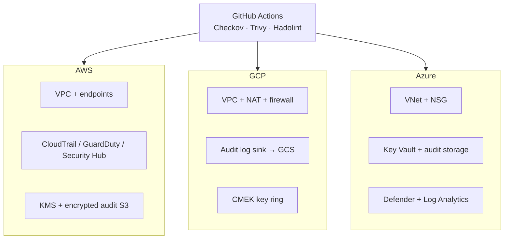

# Multi-Cloud Secure Baseline

Production Terraform and Docker configs for AWS, GCP, and Azure.

## What's included

| Path | Description |
|------|-------------|
| `terraform/aws/` | VPC, KMS, CloudTrail, GuardDuty, Security Hub, audit S3, flow logs |
| `terraform/aws/bootstrap/` | Encrypted S3 + DynamoDB remote state bootstrap |
| `terraform/gcp/` | VPC, CMEK, audit GCS, log sink, custom IAM deployer role |
| `terraform/azure/` | Key Vault, encrypted storage, NSG, flow logs, Defender, Azure Policy |
| `docker/examples/fastapi/` | Multi-stage FastAPI on Python slim, non-root (UID 10001) |
| `docker/examples/nginx-unprivileged/` | Non-root nginx (UID 101) |
| `docker/compose/docker-compose.prod.yml` | Hardened runtime flags for local integration |
| `.github/workflows/security.yml` | Checkov, Trivy, Hadolint, Gitleaks |

## Architecture



## Prerequisites

- Terraform >= 1.6
- Cloud credentials via **OIDC** or short-lived assume-role (no long-lived keys in CI)
- Docker 24+ (for image builds)

## Quick start

### 1. Bootstrap remote state (AWS example)

```bash
cd terraform/aws/bootstrap
terraform init
terraform apply -var="project=secure-baseline" -var="environment=production"
```

Copy outputs into `terraform/aws/backend.tf`, then deploy the baseline:

```bash
cd ../
cp terraform.tfvars.example terraform.tfvars   
terraform init
terraform plan
terraform apply
```

Repeat for GCP (`backend "gcs"`) and Azure (`backend "azurerm"`) using each cloud's state bootstrap pattern.

### 2. Build hardened containers

```bash
docker build -t secure-api:latest docker/examples/fastapi
docker build -t secure-nginx:latest docker/examples/nginx-unprivileged

docker compose -f docker/compose/docker-compose.prod.yml up --build
```

### 3. Run security checks locally

```bash
pip install pre-commit   
pre-commit install
pre-commit run --all-files
```

## Production deployment notes

1. **Replace placeholders** in `backend.tf` files before first `terraform init`.
2. **Use OIDC** for GitHub Actions → cloud IAM (no static AWS keys in secrets).
3. **Pin image digests** in production Dockerfiles (`image@sha256:...`).
4. **Review** `docs/COMPLIANCE.md` with your security team — map controls to your framework.
5. **Separate environments** using distinct state backends and variable files per account/subscription/project.

## Variable files

Each cloud stack ships `terraform.tfvars.example`. Copy to `terraform.tfvars` (gitignored) with real values. Never commit secrets.

## CI

Every push/PR runs:
- Terraform fmt + validate (all three clouds)
- Checkov + Trivy config scan
- Docker build + Trivy image scan
- Gitleaks secret scan

## License

MIT — see [LICENSE](LICENSE).

## Security

See [SECURITY.md](SECURITY.md) for vulnerability reporting.
